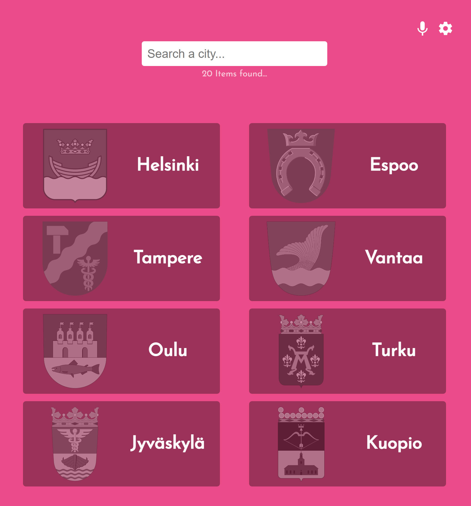
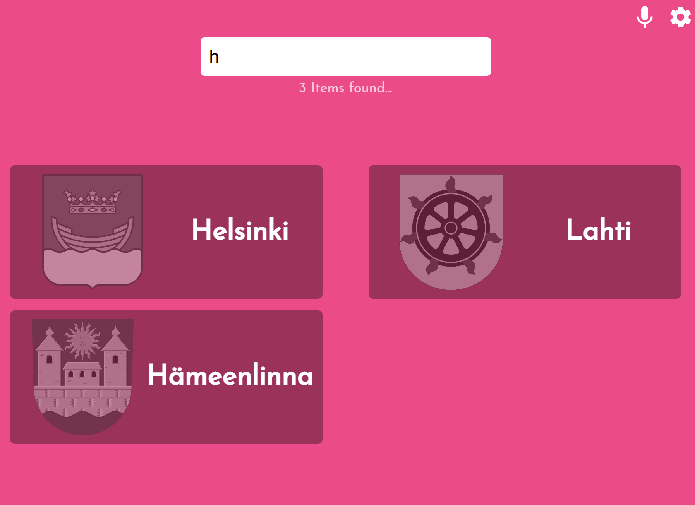
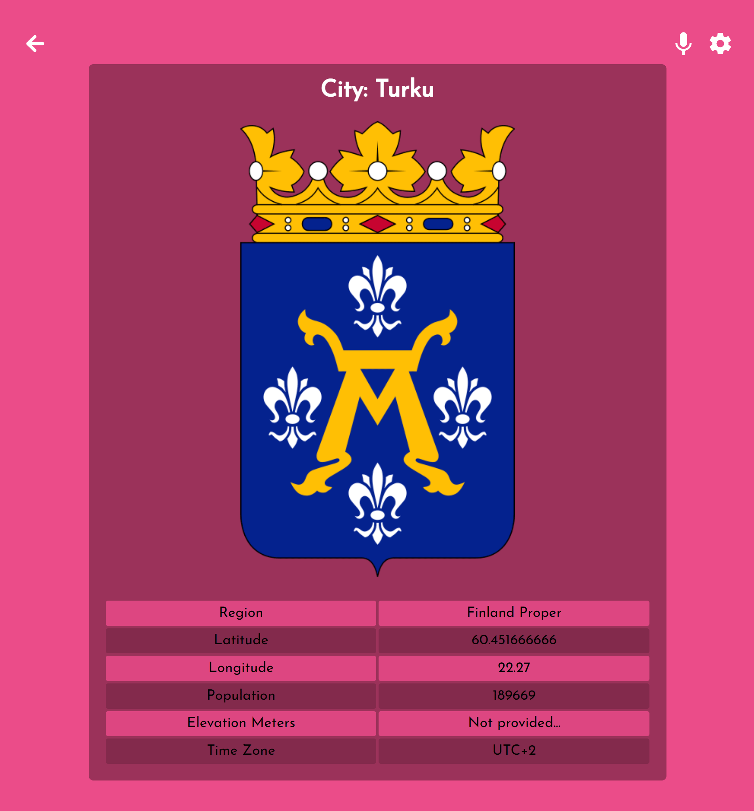

<a name="readme-top"></a>

<div align="center">
  
  <br/>
  <h3><b>Finland Cities</b></h3>
</div>

<!-- TABLE OF CONTENTS -->

# 📗 Table of Contents

- [📗 Table of Contents](#-table-of-contents)
- [🚀 Space Travelers' Hub ](#-todo-app-)
  - [🛠 Built With ](#-built-with-)
    - [Tech Stack ](#tech-stack-)
    - [Key Features ](#key-features-)
  - [🚀 Live Demo ](#-live-demo-)
  - [💻 Getting Started ](#-getting-started-)
    - [Prerequisites](#prerequisites)
    - [Setup](#setup)
    - [Install](#install)
    - [Usage](#usage)
    - [Run tests](#run-tests)
    - [Deployment](#deployment)
  - [👥 Authors ](#-authors-)
  - [🔭 Future Features ](#-future-features-)
  - [🤝 Contributing ](#-contributing-)
  - [⭐️ Show your support ](#️-show-your-support-)
  - [🙏 Acknowledgments ](#-acknowledgments-)
  - [📝 License ](#-license-)

<!-- PROJECT DESCRIPTION -->

# 📖 Finland Cities <a name="about-project"></a>

This is my capstone React/Redux project. I selected an API that gives me data on cities, and then I used React and Redux to build my web application. There are 2 pages in the app. The user may view a list of cities on the main page, as well as search and filter them. In the detailed view page, user is able to see different data about the city.

The [Ballhead](https://www.behance.net/gallery/31579789/Ballhead-App-(Free-PSDs)) app by [Nelson Sakwa](https://www.behance.net/sakwadesignstudio) served as the model for the design standards.

<div align="center">
  
  
  
  <br/>
</div>

## 🛠 Built With <a name="built-with"></a>

### Tech Stack <a name="tech-stack"></a>

- HTML
- CSS
- JavaScript
- React
- Redux

<!-- Features -->

### Key Features <a name="key-features"></a>

- List the top 20 cities in Finland by population.
- Search any city in this list.
- Display the details of each city.


<p align="right">(<a href="#readme-top">back to top</a>)</p>

<!-- LIVE DEMO -->

## 🚀 Live Demo <a name="live-demo"></a>

- Not deployed yet...

<p align="right">(<a href="#readme-top">back to top</a>)</p>

<!-- GETTING STARTED -->

## 💻 Getting Started <a name="getting-started"></a>

To get a local copy up and running, follow these steps.

### Prerequisites

In order to run this project you need [Node.js](https://nodejs.org/en/) installed on your machine.

### Setup

Clone this repository to your desired folder:

```sh
  cd my-folder
  git clone git@github.com:billymohajeri/Capstone3-Finland-Cities.git
```

### Install

Install the dependencies with:

```sh
  npm install
```

### Usage

To run the project, execute the following command:

```sh
  npm start
```

### Run tests

To run tests, run the following command:

```sh
  npm run test
```

### Deployment

You can deploy this project using:

```sh
  npm run build
```

<p align="right">(<a href="#readme-top">back to top</a>)</p>

<!-- AUTHORS -->

## 👥 Authors <a name="authors"></a>

👤 **Billy Mohajeri**

- GitHub: [@BillyMohajeri](https://github.com/billymohajeri)
- Twitter: [@BillyMohajeri](https://twitter.com/BillyMohajeri)
- LinkedIn: [@BillyMohajeri](https://www.linkedin.com/in/billymohajeri)

<p align="right">(<a href="#readme-top">back to top</a>)</p>

<!-- FUTURE FEATURES -->

## 🔭 Future Features <a name="future-features"></a>

- [ ] **Expand to all of the cities of Finland**
- [ ] **Expand to all of the countries**

<p align="right">(<a href="#readme-top">back to top</a>)</p>

<!-- CONTRIBUTING -->

## 🤝 Contributing <a name="contributing"></a>

Contributions, issues, and feature requests are welcome!

Feel free to check the [issues page](../../issues/).

<p align="right">(<a href="#readme-top">back to top</a>)</p>

<!-- SUPPORT -->

## ⭐️ Show your support <a name="support"></a>

If you like this project, please consider giving it a star.

<p align="right">(<a href="#readme-top">back to top</a>)</p>

<!-- ACKNOWLEDGEMENTS -->

## 🙏 Acknowledgments <a name="acknowledgements"></a>

- I would like to thank all code reviewers for making this project better.
- Original design idea by Nelson Sakwa on Behance.


<p align="right">(<a href="#readme-top">back to top</a>)</p>

<!-- LICENSE -->

## 📝 License <a name="license"></a>

This project is [MIT](./LICENSE/MIT.md) licensed.

<p align="right">(<a href="#readme-top">back to top</a>)</p>

